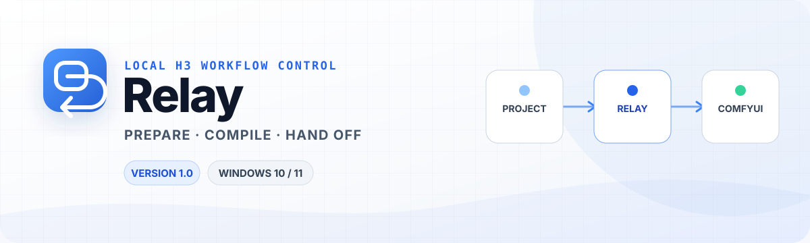

<picture>
  <source media="(prefers-color-scheme: dark)" srcset="./header-dark.svg">
  <source media="(prefers-color-scheme: light)" srcset="./header-light.svg">
  
</picture>

<p align="center">
  
  
  
  
</p>

<p align="center"><strong>准备本机环境，管理项目与素材，编译可编辑工作流，再清楚地交接给 ComfyUI。</strong></p>
<p align="center">Relay 是柏拉图灵（PlaTuring）开发的 Windows 本地安装配置器与 ComfyUI 工作流编译器。</p>

<p align="center">
  <a href="https://github.com/PlaTuring/Relay/releases/download/v1.0.0/Relay-1.0-x64-Setup.exe"></a>
</p>

<p align="center">
  <a href="https://github.com/PlaTuring/Relay/releases/tag/v1.0.0">发布说明</a>
  · <a href="#开始使用">开始使用</a>
  · <a href="#安全与产品边界">安全与产品边界</a>
  · <a href="https://github.com/PlaTuring">开发者主页</a>
</p>

> [!IMPORTANT]
> **当前正式版本是 Relay 1.0。** 内部版本号为 `1.0.0`，界面显示 `1.0`，GitHub Release 标签为 [`v1.0.0`](https://github.com/PlaTuring/Relay/releases/tag/v1.0.0)。支持 Windows 10 / 11 x64。

## Relay 是什么

Relay 把复杂的本地准备工作收拢到一个可检查的流程中：检测或安装 ComfyUI 与 MiniMax H3 组件，管理项目和素材，确定性编译 T2V、FL2VA、Ref2VA 及分段工作流，并在 ComfyUI 中打开本次可编辑工作流。

```text
项目与素材  →  Relay 确定性编译  →  ComfyUI 可编辑工作流  →  用户点击 Run  →  MiniMax H3 生成
```

Relay 不替用户运行模型。你始终可以在 ComfyUI 中先检查节点、提示词、素材、模型、种子与输出设置，再决定是否点击 Run。

## 核心工作区

| 工作区 | 用途 |
| --- | --- |
| **项目** | 新建、打开、复制、安全删除和恢复本地项目。 |
| **快速创建** | 以最少参数编译 T2V、FL2VA 或 Ref2VA 工作流。 |
| **专业导播** | 管理场景、镜头、素材关系、连续性、种子与分段工作流。 |
| **素材库** | 显式导入本地图片、视频和音频；默认复制到项目，不上传云端或修改源文件。 |
| **ComfyUI 结果发现（已生成视频）** | 发现当前项目已完成写盘的 ComfyUI 输出，也可由用户手动补录旧输出。 |
| **安装与组件** | 检测并复用现有 ComfyUI / 模型，或在用户选定的数据目录中安装缺失组件。 |
| **画质超分** | 功能规划中；当前不提供未实现按钮或伪功能。 |

## 开始使用

1. 下载 [`Relay-1.0-x64-Setup.exe`](https://github.com/PlaTuring/Relay/releases/download/v1.0.0/Relay-1.0-x64-Setup.exe)。
2. 检查下载来源和文件名，然后由你亲自运行安装程序。
3. 首次设置时确认 Relay 数据目录。默认建议使用受支持的本机固定 NTFS 数据盘，例如 `D:\MiniMaxH3`。
4. 复用已有 ComfyUI / 模型，或在“安装与组件”中安装缺失的必需项。
5. 在快速创建或专业导播中编译，并在 ComfyUI 中检查本次工作流。
6. 只有你在 ComfyUI 中亲自点击 Run 后，MiniMax H3 才会开始生成视频与原生音频。

本版本只提供 Setup 安装包，不提供 Portable。安装版默认创建桌面和开始菜单快捷方式。GitHub 自动生成的 Source code 压缩包不是 Relay 安装包。

### 安装包完整性

```powershell
Get-FileHash .\Relay-1.0-x64-Setup.exe -Algorithm SHA256
```

预期 SHA-256：

```text
a6ad3dd611411536cd80efda94aeb7947fbfe93c9d5eb050016dde8d5a293efa
```

## 安全与产品边界

- 不后台检查更新，不静默下载，也绝不自动执行安装程序。
- 不添加云端生成 API，不隐藏上传用户项目、素材或提示词。
- 外部已有 ComfyUI 和模型默认只读复用，不移动、不覆盖、不删除。
- 程序二进制安装目录与业务数据目录分离，大型数据不会静默回退到 C 盘。

## 本地数据与生成结果

项目、素材、模型、工作流、恢复数据、下载与日志保存在用户选择的 `dataRoot` 下。Electron 用户目录只保留很小的数据目录指针及不可避免的运行缓存。

Relay 1.0 会为当前项目和工作流写入不含项目名、提示词或本机路径的安全输出前缀。用户在 ComfyUI 点击 Run 且 `SaveVideo` 完成写盘后，Relay 才会把稳定、通过本地检查的视频显示在“已生成视频”中。

旧版通用前缀、自定义 ComfyUI 输出目录或用户改名的视频需要手动补录。只有用户明确点击“加入素材库”后，Relay 才会复制并校验项目副本；ComfyUI 原始输出保持不变。

## 更新机制

“关于”页面只在用户主动点击后匿名读取 `PlaTuring/Relay` 的公开 Stable Release。Relay 只接受严格稳定 SemVer、唯一匹配的 Setup 资产、有效长度和 GitHub SHA-256 摘要；候选不合格时会准确失败，不回退到较旧版本。

下载完成后，Relay 只提供“打开所在目录”和“打开发布页”，绝不执行 EXE。

## 作者与声明

- **开发者**：柏拉图灵 | PlaTuring
- **抖音 / B站**：柏拉图灵
- **GitHub**：<https://github.com/PlaTuring>
- **Relay**：<https://github.com/PlaTuring/Relay>

Relay 是独立开发的第三方工具，不是 MiniMax、ComfyUI 或 Comfy-Org 的官方产品，与其权利人不存在隶属、赞助或背书关系。MiniMax H3 的模型、许可与使用限制以其官方发布内容为准。

软件 Logo、作者信息与 Relay 品牌只属于软件界面，不会写入生成的视频、图片或音频。

---

<p align="center">本仓库用于 Relay 的产品介绍与官方二进制 Release。</p>
