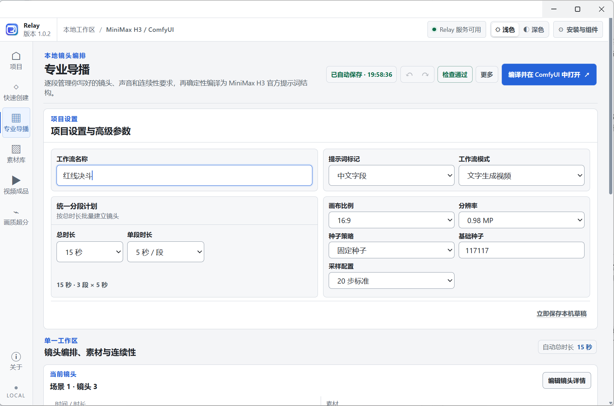

<picture>
  <source media="(prefers-color-scheme: dark)" srcset="./header-dark.svg">
  <source media="(prefers-color-scheme: light)" srcset="./header-light.svg">
  
</picture>

<p align="center">
  
  
  
  
</p>

<p align="center"><strong>准备本机环境，管理项目与素材，编译可编辑工作流，再清楚地交接给 ComfyUI。</strong></p>

<p align="center">
  <a href="https://github.com/PlaTuring/Relay/releases/download/v1.0.2/Relay-1.0.2-x64-Setup.exe"><strong>下载 Windows 安装包</strong></a>
  · <a href="https://github.com/PlaTuring/Relay/releases/tag/v1.0.2">查看 1.0.2 发布说明</a>
  · <a href="#从源码构建">从源码构建</a>
</p>

> **当前稳定版：Relay 1.0.2** · 支持 Windows 10 / 11 x64 · 正式 Release 仅提供 Setup 安装包。

## 界面导览

<p align="center">
  
</p>

<p align="center"><sub>Relay 1.0.2 软件实际界面：专业导播的项目设置、生成参数与镜头工作区。</sub></p>

## Relay 是什么

Relay 是面向 Windows 10 / 11 x64 的本地安装配置器、项目与素材管理器，
也是 MiniMax H3 的确定性 ComfyUI 工作流编译器。它把环境检测、受管组件
安装、项目准备、工作流校验和 ComfyUI 交接组织在一个可检查的流程中。

```text
项目与素材  →  Relay 确定性编译  →  ComfyUI 可编辑工作流
```

| 本机准备 | 工作流编排 | 清晰交接 |
| --- | --- | --- |
| 检测并复用兼容的 ComfyUI 与 H3 组件，缺失项可安装到用户选择的数据目录。 | 管理项目、素材、镜头、连续性、种子和 T2V / FL2VA / Ref2VA 参数。 | 生成可检查、可修改的 ComfyUI 工作流，并在交接前完成确定性校验。 |

## 使用流程

1. **准备环境**：选择本机数据目录，检测或安装所需的 ComfyUI 与 H3 组件。
2. **组织项目**：在快速创建或专业导播中配置提示词、素材、镜头与输出参数。
3. **编译交接**：由 Relay 校验并打开可编辑工作流，再由用户在 ComfyUI 中明确启动执行。
4. **查看结果**：`SaveVideo` 完成写盘后，Relay 在当前项目的安全输出范围内发现并校验视频。

## 主要工作区

| 工作区 | 功能 |
| --- | --- |
| 项目 | 新建、打开、复制、安全删除和恢复本地项目。 |
| 快速创建 | 用精简参数编译 T2V、FL2VA 或 Ref2VA 工作流。 |
| 专业导播 | 管理场景、镜头、素材关系、连续性、种子和分段工作流。 |
| 素材库 | 显式导入本地图片、视频和音频；默认复制到项目，不上传或修改源文件。 |
| 视频成品 | 发现当前项目已稳定写盘的有界 ComfyUI 输出，并可手动补录旧输出。 |
| 安装与组件 | 检测并复用兼容的 ComfyUI / 模型，或向选定数据目录安装缺失组件。 |
| 画质超分 | 规划中的独立页面；当前不提供按钮或伪功能。 |

## 产品边界

Relay 只负责安装、检测、配置、项目与素材管理、确定性工作流编译及交接。
它的交付止于可检查、可继续编辑的 ComfyUI 工作流；模型推理与媒体产出始终
由 ComfyUI 中的 MiniMax H3 在用户明确发起后完成。

编译得到的工作流保持可编辑，可以在 ComfyUI 中检查节点、提示词、素材、
模型、种子和输出设置。Relay 不提供云端推理后端，也不会把项目、素材或
提示词隐藏上传到云端。

## 安装

从 [Relay 1.0.2 Release](https://github.com/PlaTuring/Relay/releases/tag/v1.0.2)
下载 [`Relay-1.0.2-x64-Setup.exe`](https://github.com/PlaTuring/Relay/releases/download/v1.0.2/Relay-1.0.2-x64-Setup.exe)。
GitHub 自动生成的 Source code 压缩包是源码快照，不是 Windows 安装程序。

下载后可在 PowerShell 中核对文件完整性：

```powershell
Get-FileHash .\Relay-1.0.2-x64-Setup.exe -Algorithm SHA256
```

预期 SHA-256：

```text
345b32283cd77b989eae92b4cf96c929378ff52a19847ccfff3e0aca5a57a7fe
```

## 本地数据与结果

Relay 将项目、素材、模型、工作流、恢复数据、下载和日志保存在选定的
`dataRoot` 中。首次配置默认建议使用受支持的本机固定 NTFS 数据盘，例如
`D:\MiniMaxH3`；没有合格数据盘时不会静默把大型数据写回 C 盘。Electron
用户目录只保存小型数据目录指针和无法避免的运行缓存。

ComfyUI 完成 `SaveVideo` 写盘后，Relay 只扫描当前项目已交接工作流的安全
输出前缀。文件通过稳定性、类型、摘要和媒体检查后才出现在“视频成品”中。
只有显式选择“加入素材库”才会复制并校验项目副本，原始输出保持不变。

## 项目结构

| 路径 | 内容 |
| --- | --- |
| `apps/control-plane` | Relay Electron 桌面控制面与 Windows 打包配置。 |
| `packages/detection` | 本机硬件、ComfyUI 与模型的只读检测能力。 |
| `packages/installer` | 受管组件安装、校验和恢复流程。 |
| `packages/workflow` | MiniMax H3 工作流解析、校验和确定性编译。 |
| `packages/local-runtime` | 本地运行时编排与受限 IPC 合同。 |
| `native/` | Windows 本机 helper 与受限系统操作适配。 |
| `schemas/` | 项目、组件、能力目录及工作流的版本化契约。 |

## 从源码构建

运行 JavaScript/TypeScript 测试需要 Windows 10 / 11 x64、Node.js 24 或更高
版本，以及 npm。完整 `build:product` 还会从源码构建本机 helper，因此必须安装
Visual Studio Build Tools 2022，并提供仓库当前锁定的 MSVC toolset
`14.44.35207`（编译器 `19.44.35228`）及 Windows SDK `10.0.26100.0`；构建脚本
会校验这些固定版本，不会静默改用其他工具链。

```powershell
npm --prefix apps/control-plane ci
node apps/control-plane/node_modules/electron/install.js
npm --prefix apps/control-plane run typecheck
npm test
npm run verify:oss
```

`electron/install.js` 只下载 `package-lock.json` 已锁定版本的 Electron 开发运行时；
必须在进入断网测试前执行，否则全新检出尚不存在 `electron.exe`，UI 冒烟会按
“运行时缺失”失败。它不会下载或安装 ComfyUI、模型或媒体生成组件。

具备上述锁定 C++ 工具链后，再执行完整产品构建：

```powershell
npm run build:product
```

专项供应链检查：

```powershell
npm --prefix apps/control-plane run licenses:source
npm --prefix apps/control-plane run sbom:source
npm --prefix apps/control-plane run verify:offline -- --source-only
```

打包流程还会校验冻结的输入清单和额外资源。版本化发布目录必须预先不存在；
冻结完成后只允许本次请求的 Setup/Portable 文件与 `SHA256SUMS.txt`。本地
`release-v*/`、`.build-cache/`、原生二进制、`.relayproj`、模型和媒体文件均
不得进入源码提交。去掉 `--source-only` 的完整离线发布门禁还要求同一候选的
安装、快捷方式、启动与卸载验证证据，因此不属于普通源码检出后的开发检查。

## 贡献与安全

- [贡献指南](CONTRIBUTING.md)
- [安全报告](SECURITY.md)
- [行为准则](CODE_OF_CONDUCT.md)
- [第三方组件与分发边界](THIRD_PARTY_NOTICES.md)

漏洞请通过仓库的私有安全报告渠道提交，不要在公开 issue 中附带凭据、完整
提示词、项目文件、用户名或私有绝对路径。

## 许可证

有权由 Relay 贡献者许可的原创源码、文档、测试和资产采用
[Apache License 2.0](LICENSE)。各 `package.json` 继续保留 `private: true`，
这是阻止误发 npm 包的发布保护，不会把仓库改成闭源，也不改变 Apache-2.0
授予的源码权利。

第三方依赖、模型、上游模板、名称和商标继续受各自条款约束，不会因 Relay
采用 Apache-2.0 而被重新许可。About 使用的发布者标识已在
[第三方说明](THIRD_PARTY_NOTICES.md) 中按精确文件与 SHA-256 单独记录，只获准
随未修改 Relay 分发，不属于 Apache-2.0。未获确认的外部组件或资产不会进入
公开源码或安装包；发布前仍须检查 [外部门禁](docs/EXTERNAL_GATES.md) 和
[风险登记](docs/RISK_REGISTER.md)。

## 非官方关系

MiniMax H3、ComfyUI、Comfy-Org、Windows 及其他名称仅用于描述兼容对象。
Relay 是独立的第三方工具，不是 MiniMax、ComfyUI、Comfy-Org、Microsoft
或相关上游项目的官方产品，也不因技术兼容而获得其赞助或认可。
